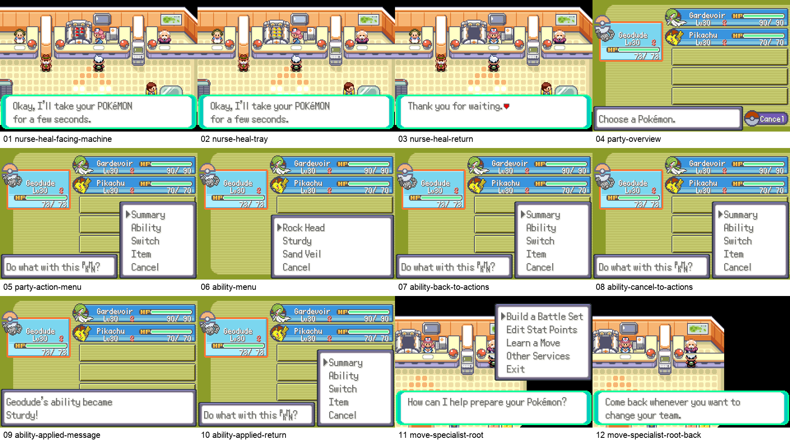
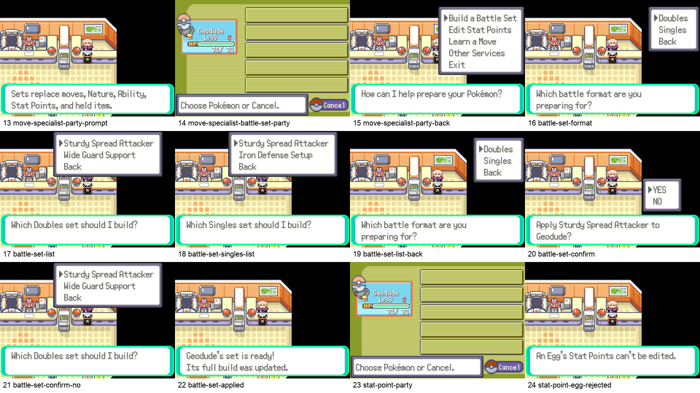
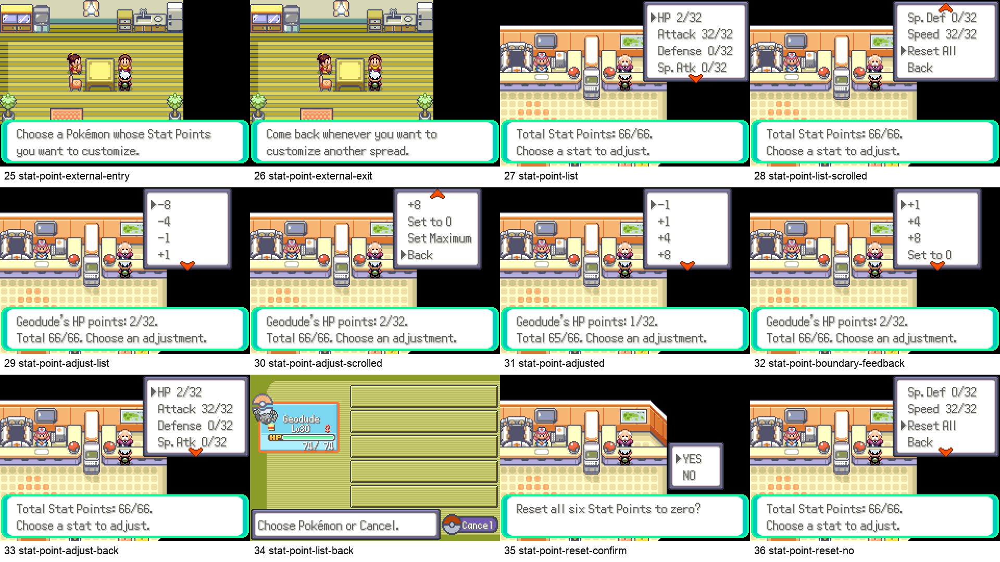
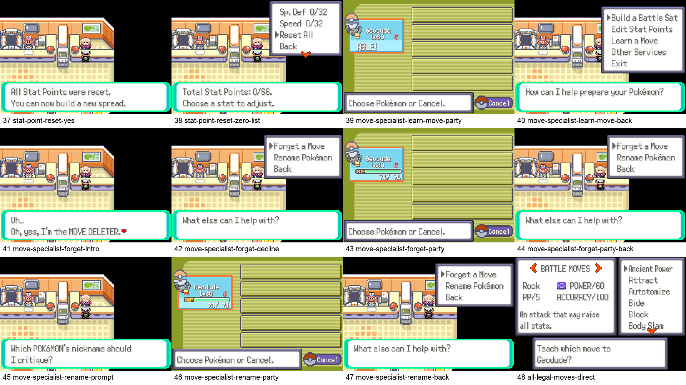
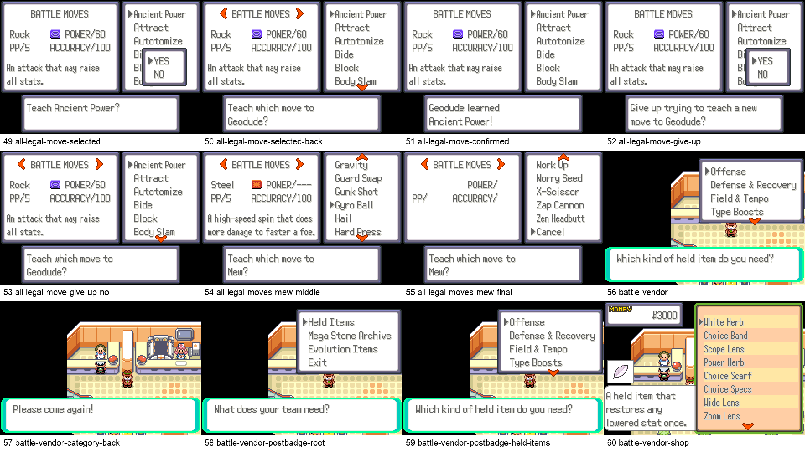
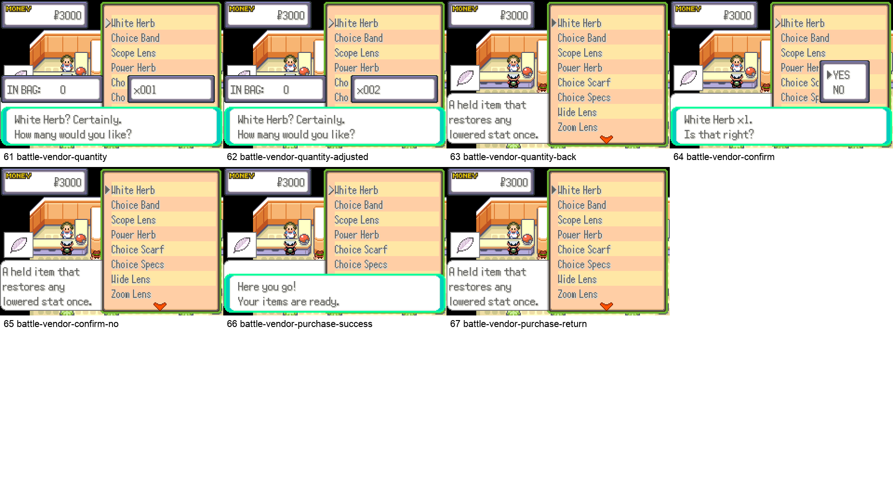

# Emerald Champions Native Service UI Audit

## Audit scope

Release-candidate headless ROM SHA-256: `17dbb57b2727a91aa2dd6a4351a5fc4c6f67cee65b9082af081b40cc3e2fd5cb`.

This audit covers the complete 67-state Pokémon Center preparation flow: Nurse Joy, party Ability selection, the move specialist, named Singles and Doubles battle sets, Stat Point editing, Learn/Forget/Rename services, the complete legal-move list, and the free battle-item vendor. The authoritative replay record is `rendered/native-menu-release-2026-08-31/manifest.service-ui.json`.

## Verdict

PASS. Every captured state uses native Emerald framing and font rendering. No accepted screen has clipped text, overlapping windows, an obscured bottom textbox, a menu crossing the 20-tile screen boundary, or a Back/Cancel path returning to the wrong level.

The final implementation also enforces exact normal-font widths across all 5,311 battle-set labels: the widest menu label is 134 px, and the widest confirmation line is 180 px inside the 216 px dialogue width.

## Complete step record

| Step | State | Health |
|---:|---|:---:|
| 1 | nurse heal facing machine | PASS |
| 2 | nurse heal tray | PASS |
| 3 | nurse heal return | PASS |
| 4 | party overview | PASS |
| 5 | party action menu | PASS |
| 6 | ability menu | PASS |
| 7 | ability back to actions | PASS |
| 8 | ability cancel to actions | PASS |
| 9 | ability applied message | PASS |
| 10 | ability applied return | PASS |
| 11 | move specialist root | PASS |
| 12 | move specialist root back | PASS |
| 13 | move specialist party prompt | PASS |
| 14 | move specialist battle set party | PASS |
| 15 | move specialist party back | PASS |
| 16 | battle set format | PASS |
| 17 | battle set list | PASS |
| 18 | battle set singles list | PASS |
| 19 | battle set list back | PASS |
| 20 | battle set confirm | PASS |
| 21 | battle set confirm no | PASS |
| 22 | battle set applied | PASS |
| 23 | stat point party | PASS |
| 24 | stat point egg rejected | PASS |
| 25 | stat point external entry | PASS |
| 26 | stat point external exit | PASS |
| 27 | stat point list | PASS |
| 28 | stat point list scrolled | PASS |
| 29 | stat point adjust list | PASS |
| 30 | stat point adjust scrolled | PASS |
| 31 | stat point adjusted | PASS |
| 32 | stat point boundary feedback | PASS |
| 33 | stat point adjust back | PASS |
| 34 | stat point list back | PASS |
| 35 | stat point reset confirm | PASS |
| 36 | stat point reset no | PASS |
| 37 | stat point reset yes | PASS |
| 38 | stat point reset zero list | PASS |
| 39 | move specialist learn move party | PASS |
| 40 | move specialist learn move back | PASS |
| 41 | move specialist forget intro | PASS |
| 42 | move specialist forget decline | PASS |
| 43 | move specialist forget party | PASS |
| 44 | move specialist forget party back | PASS |
| 45 | move specialist rename prompt | PASS |
| 46 | move specialist rename party | PASS |
| 47 | move specialist rename back | PASS |
| 48 | all legal moves direct | PASS |
| 49 | all legal move selected | PASS |
| 50 | all legal move selected back | PASS |
| 51 | all legal move confirmed | PASS |
| 52 | all legal move give up | PASS |
| 53 | all legal move give up no | PASS |
| 54 | all legal moves mew middle | PASS |
| 55 | all legal moves mew final | PASS |
| 56 | battle vendor | PASS |
| 57 | battle vendor category back | PASS |
| 58 | battle vendor postbadge root | PASS |
| 59 | battle vendor postbadge held items | PASS |
| 60 | battle vendor shop | PASS |
| 61 | battle vendor quantity | PASS |
| 62 | battle vendor quantity adjusted | PASS |
| 63 | battle vendor quantity back | PASS |
| 64 | battle vendor confirm | PASS |
| 65 | battle vendor confirm no | PASS |
| 66 | battle vendor purchase success | PASS |
| 67 | battle vendor purchase return | PASS |

## Contact sheets

## Findings closed during this audit

- Added the native Stat Point editor: 0–32 per stat, 66 total, perfect hidden IV backing, live stat recalculation, and the same service in every Center and Fallarbor.
- Added native failure feedback when an edit is blocked at 0, 32, or the 66-point total cap.
- Removed redundant acknowledgement pauses before Stat Point and set-selection lists.
- Corrected stale screenshot timings that had captured transitional or mislabeled states.
- Shortened dynamic set confirmation and success copy after a real clipped line was found.
- Proved every hidden/scrolled row, adjustment, reset choice, Egg rejection, external entry/exit, and one-level Back path.

## Evidence limits

Screenshots prove rendered geometry and visible navigation states. The native failure sound is not visible; its branch is covered by source gates and the passing runtime test. Timing and subjective feel still benefit from human play, but no static or rendered defect remains in this audited flow.

