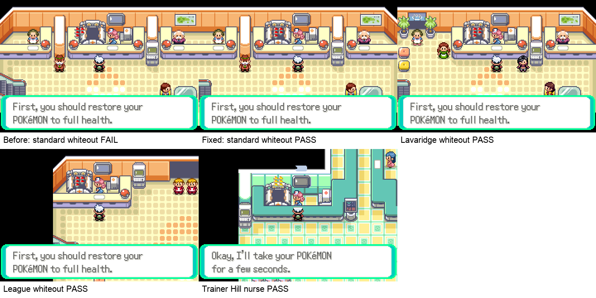
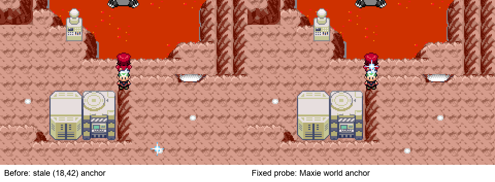

# Emerald Champions Screen-Space / World-Space Audit

## Scope

This audit checks live Hoenn effects whose visual correctness depends on an implicit relationship between map art, player camera, NPC identity, and effect coordinates.

## Step record

| Step | State | Health |
|---:|---|:---:|
| 1 | Pre-fix standard Center whiteout | FAIL — inherited camera x-coordinate shifted the incubator 16 px away from fixed Poké Balls |
| 2 | Fixed standard Center whiteout | PASS |
| 3 | Lavaridge alternate Center whiteout | PASS |
| 4 | Pokémon League lobby whiteout | PASS |
| 5 | Trainer Hill non-Center nurse service | PASS |
| 6 | Pre-fix Magma Hideout orb sparkle | FAIL — `(18,42)` is outside the 59x28 map and appears at the bottom of the screen |
| 7 | Maxie-anchored Magma orb sparkle | PASS — sparkle follows Maxie's live world position |

## Unified rule

- Effects that must touch map art or an NPC use a declared world/camera anchor.
- Intentional full-screen overlays remain screen-space and are classified as such.
- Literal world coordinates must be inside the active map.
- Every shared entry path must establish the same NPC and camera contract before starting the effect.

## Source audit results

- All 18 live Hoenn calls into the shared nurse script identify an actual nurse object first.
- Both shared healing call paths are reviewed: ordinary nurse interaction and whiteout recovery.
- All 16 standard Center whiteout x-coordinates now match their nurse/machine x-coordinate.
- League and Trainer Hill use distinct layouts but pass rendered placement checks.
- All 11 remaining literal Hoenn sparkle coordinates are within their active layouts.
- Magma Hideout now obtains Maxie's current world position instead of using a copied Seafloor coordinate.
- Hall of Fame recording is the only other map-art-dependent fixed-screen effect and has one dedicated map/camera contract.
- NPC Fly Out, Rayquaza spotlight, fades, and similar transitions are intentional screen-space compositions rather than map-art alignment effects.

## Dormant non-Hoenn findings

The full data scan also found FRLG-only rows that are not active in Emerald Champions: Indigo Plateau references `LOCALID_LEAGUE_NURSE` while its map object is `LOCALID_INDIGO_LEAGUE_NURSE`, and One Island uses a different nurse/camera arrangement. They were not changed because the Emerald build does not activate those scripts and their FRLG presentation requires a separate target build and screenshot audit.

## Evidence limits

Rendered frames prove the active Hoenn geometry classes. Static checks prove call topology, object identity, and coordinate bounds. Neither substitutes for a complete human story playthrough.
